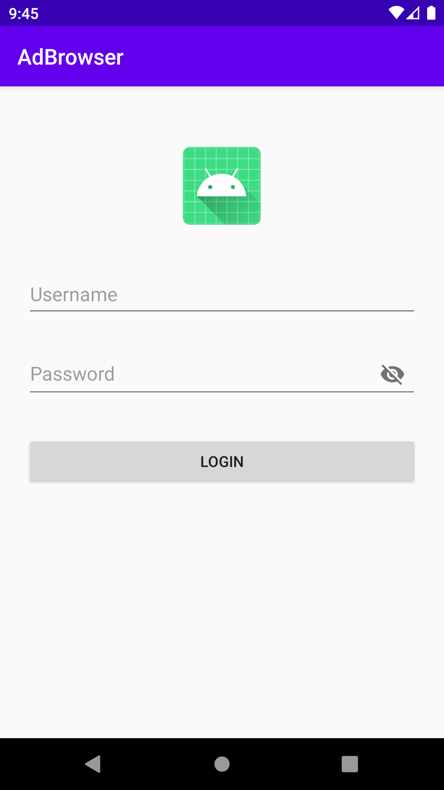
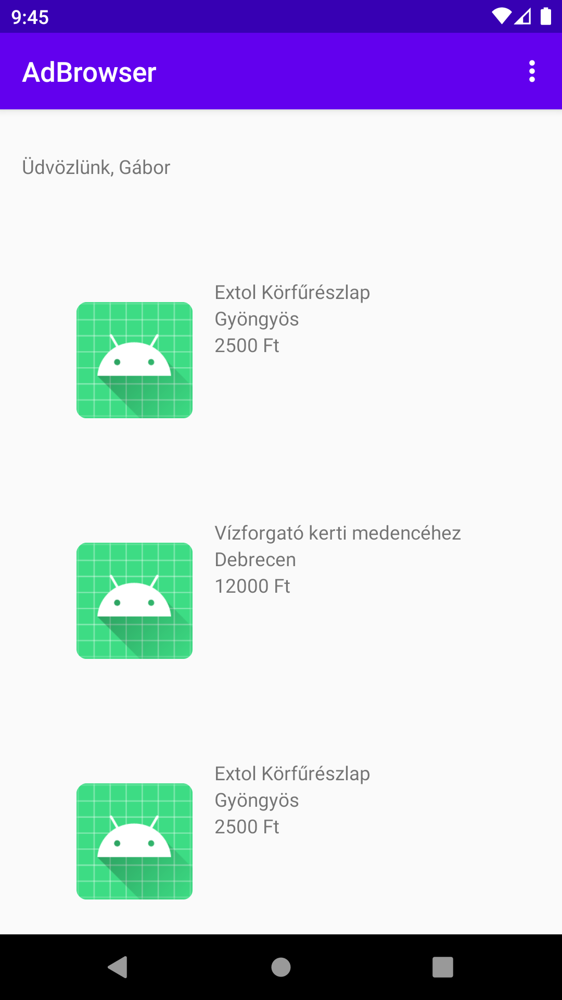
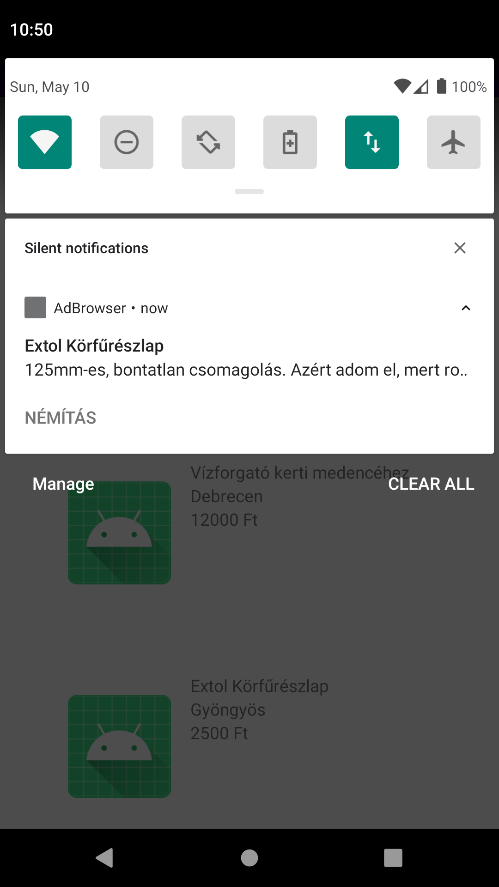
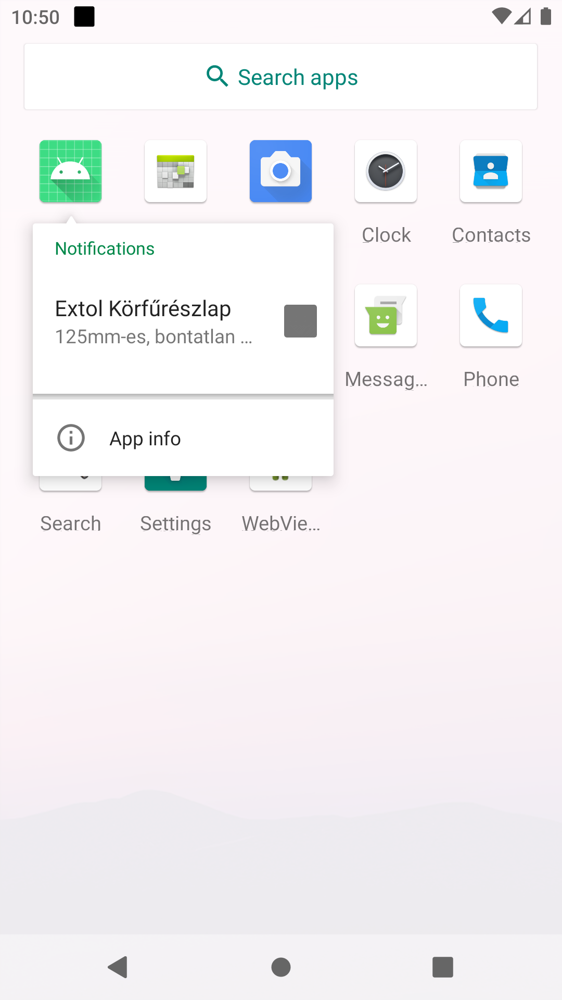
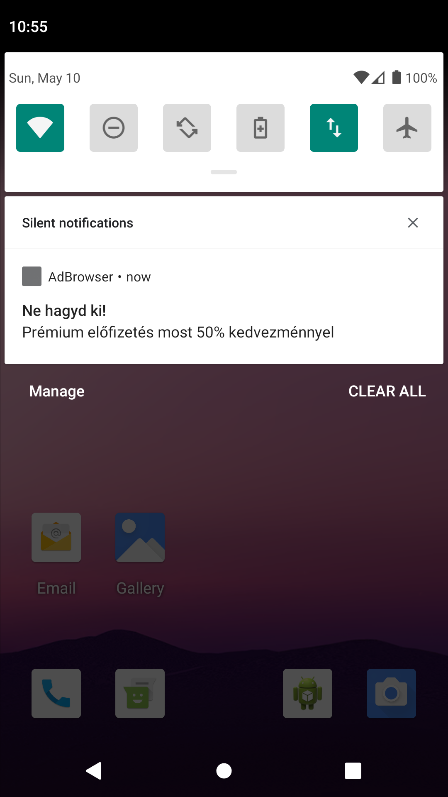
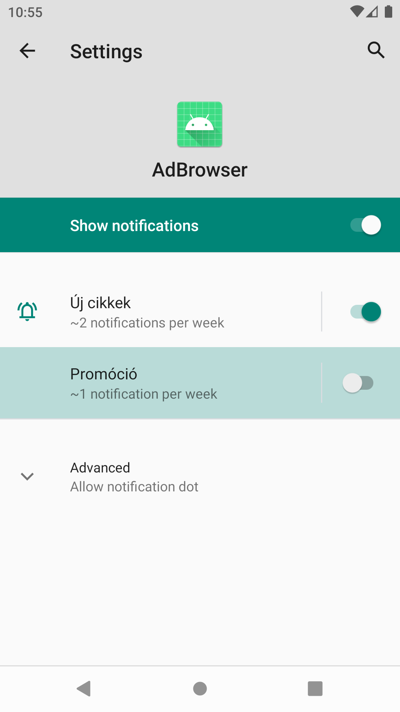

# Navigáció és értesítések

## Bevezetés

Ebben a laborban az Android Jetpackben bevezetett navigációs megoldást ismerjük meg,
illetve áttekintjük az értesítésekben rejlő lehetőségeket. A példaalkalmazásunk a témához
egy apróhirdetési portál felülete lesz, ebben a navigációra és a notificationökre koncentrálunk,
nem alkalmazunk sem hálózati kommunikációt, sem adattárolást, és a felületek esztétikájára
sem fordítunk túl sok gondot. Az adatokat csupán egy előre feltöltött listából
nyerjük ki.

<p align=center>



</p>

## A projekt létrehozása

Első lépésként hozzunk létre egy `AdBrowser` nevű projektet, a `hu.bme.aut.adbrowser` csomagnévvel,
Kotlin támogatással, és kezdésnek egy *Empty Activity*-vel.

## Adatmodell és listázás

Ebben a rövid előkészítő részben nincs lényeges új ismeret, ezért ezeket részletesen nem magyarázzuk.

Mivel használjuk majd a `RecyclerView`, `LiveData` és `ViewModel` komponenseket, a modulszintű `build.gradle` fájlba
vegyük fel az alábbi függőségeket:

```gradle
    implementation 'androidx.recyclerview:recyclerview:1.1.0'

    def lifecycle_version = "2.2.0"
    implementation "androidx.lifecycle:lifecycle-livedata-ktx:$lifecycle_version"
    implementation "androidx.lifecycle:lifecycle-viewmodel-ktx:$lifecycle_version"
```

Készítsünk egy `model` csomagot, és ebben hozzunk létre egy `Ad` osztályt a hirdetések tárolásához:

```kotlin
data class Ad(
    val id: Long?,

    val title: String,

    val description: String,

    val location: String,

    val price: Long
)
```

A listában meg kell tudnunk jeleníteni az egyes hirdetéseket, ahhez készítsük el az
`ad_list_item.xml` layout erőforrást:

```xml
<LinearLayout xmlns:android="http://schemas.android.com/apk/res/android"
    android:layout_width="match_parent"
    android:layout_height="wrap_content"
    android:orientation="horizontal"
    android:paddingLeft="24dp"
    android:paddingTop="56dp"
    android:paddingRight="24dp">

    <ImageView
        android:id="@+id/adItemImg"
        android:layout_width="0dp"
        android:layout_height="120dp"
        android:layout_weight="0.3"
        android:src="@mipmap/ic_launcher" />

    <LinearLayout
        android:layout_width="0dp"
        android:layout_height="wrap_content"
        android:layout_marginLeft="16dp"
        android:layout_weight="0.7"
        android:orientation="vertical">

        <TextView
            android:id="@+id/tvItemTitle"
            android:layout_width="match_parent"
            android:layout_height="wrap_content"
            android:text="Title" />

        <TextView
            android:id="@+id/tvItemLocation"
            android:layout_width="match_parent"
            android:layout_height="wrap_content"
            android:text="Location" />

        <TextView
            android:id="@+id/tvItemPrice"
            android:layout_width="match_parent"
            android:layout_height="wrap_content"
            android:text="Price" />
    </LinearLayout>
</LinearLayout>
```

Készítsünk egy `adapter` csomagot, és ebben egy `AdRecyclerViewAdapter` osztályt a listázás kezeléséhez:

```kotlin
class AdRecyclerViewAdapter : RecyclerView.Adapter<AdRecyclerViewAdapter.ViewHolder>() {

    private val adList = mutableListOf<Ad>()

    var itemClickListener: TodoItemClickListener? = null

    override fun onCreateViewHolder(parent: ViewGroup, viewType: Int): ViewHolder {
        val view = LayoutInflater.from(parent.context)
            .inflate(R.layout.ad_list_item, parent, false)
        return ViewHolder(view)
    }

    override fun onBindViewHolder(holder: ViewHolder, position: Int) {
        val ad = adList[position]

        holder.ad = ad
        holder.tvItemTitle.text = ad.title
        holder.tvItemLocation.text = ad.location
        holder.tvItemPrice.text = ad.price.toString() + " Ft"
    }

    fun addItem(ad: Ad) {
        val size = adList.size
        adList.add(ad)
        notifyItemInserted(size)
    }

    fun addAll(ads: List<Ad>) {
        val size = adList.size
        adList += ads
        notifyItemRangeInserted(size, ads.size)
    }

    fun deleteRow(position: Int) {
        adList.removeAt(position)
        notifyItemRemoved(position)
    }

    override fun getItemCount() = adList.size

    inner class ViewHolder(itemView: View) : RecyclerView.ViewHolder(itemView) {
        val tvItemTitle: TextView = itemView.tvItemTitle
        val tvItemLocation: TextView = itemView.tvItemLocation
        val tvItemPrice: TextView = itemView.tvItemPrice

        var ad: Ad? = null

        init {
            itemView.setOnClickListener {
                ad?.let { itemClickListener?.onItemClick(it) }
            }
        }
    }

    interface TodoItemClickListener {
        fun onItemClick(ad: Ad)
    }
}
```

Készítsünk egy `repository` csomagot, és ebben egy `AdRepository` osztályt. A korábbi perzisztencia laboron
látott módon ez lesz az adatforrás absztrakciója, és egy éles alkalmazásnál hálózatról vagy lokális
SQLite adatbázisból töltené be az adatokat. Most azonban egy közvetlen beépített listát használunk az
adatok tárolásához:

```kotlin
class AdRepository {
    private val ads = mutableListOf(
        Ad(
            1,
            "Extol Körfűrészlap",
            "125mm-es, bontatlan csomagolás. Azért adom el, mert rossz típust vásároltam.",
            "Gyöngyös",
            2500
        ),
        Ad(
            2,
            "Vízforgató kerti medencéhez",
            "Félcolos nyílásra csatlakoztatható",
            "Debrecen",
            12000
        ),

        Ad(
            3,
            "Extol Körfűrészlap",
            "125mm-es, bontatlan csomagolás. Azért adom el, mert rossz típust vásároltam.",
            "Gyöngyös",
            2500
        ),

        Ad(
            4,
            "Pendrive 6GB",
            "Hibátlan, USB2-es.",
            "Gödöllő",
            3700
        )
    )

    fun getAll() = MutableLiveData(ads)

    fun getById(id: Long) = ads.filter { it.id == id }.getOrNull(0).also { MutableLiveData(it) }

    fun add(ad: Ad) {
        ads.add(ad)
    }
}
```

Az `AdRepository` osztályból egyet szeretnénk létrehozni az alkalmazáson belül, és minden komponensben
ezt megosztani. Egyrészt felesleges és pazarló több példányt létrehozni, másrészt ha jelen esetben a beépített
listába az új elem felvitelét is támogatni szeretnénk, akkor fontos, hogy ez ugyanaz a lista legyen,
amelyet majd a listázáskor is felhasználunk. Ezért gondoskodni kell róla, hogy egy példány jöjjön létre, és ezt
az alkalmazás komponensei közt meg tudjuk osztani. Ehhez bevett megoldás egy `Application` osztály
létrehozása. Hozzunk létre ezért a főcsomagunkban egy `AdBrowserApplication` osztályt:

```kotlin
class AdBrowserApplication : Application() {

    companion object {
        lateinit var adRepository: AdRepository
            private set
    }

    override fun onCreate() {
        super.onCreate()
        adRepository = AdRepository()
    }
}
```

> Az egy példány létrehozása és az alkalmazáson belüli megosztása függőséginjektálással (dependency injection)
> is megoldható lenne. Ennek további előnyei is vannak, de ez túlmutat a tárgy anyagán. Az érdeklődőknek az
> elterjedtebb Dagger vagy az újabb, kotlinos Koin könyvtár vizsgálatát javasoljuk.

Ezt a Manifestben is regisztrálnunk kell, az `<application>` XML-elem attribútumaként. Cseréljük le
ennek az elemnek a nyitó tagját:

```xml
    <application
        android:allowBackup="true"
        android:icon="@mipmap/ic_launcher"
        android:label="@string/app_name"
        android:roundIcon="@mipmap/ic_launcher_round"
        android:supportsRtl="true"
        android:theme="@style/AppTheme"
        android:name=".AdBrowserApplication">
```

## A navigáció kialakítása

Korábban a navigációt körülményesebben kellett megoldanunk. Ha új Activity komponensre szerettünk volna
navigálni, akkor egy Intentet kellett létrehozni, és elküldeni. Ha viszont Fragmenteket használtunk,
azokat kellett az Activity-n belül lecserélni. A navigáció tehát nem volt túl egységes, ráadásul a
navigáció nem volt egységes helyre kiszervezve, nem tudtuk könnyen átlátni az appon belüli navigációs
folyamatot, csak ha kikerestük a kódban ezeket a részeket. A Jetpack Navigation Component egy egységes
navigációs megoldást nyújt az app számára. Bevezette a navigációs gráfot, mint új erőforrás-típust.
Ebben deklaratívan írhatjuk le az egyes navigációs célpontokat, ezek lehetnek Activity-k és
Fragmentek is. A célpontok közé akciókat vehetünk fel, ezek képezik az átmenetet két célpont között.
A célpontok pedig paramétereket is kaphatnak, pl. egy részletező nézet megkaphatja annak az entitásnak
a kulcsát, amelynek a részleteit meg kell mutatnia.

A Navigation component jól támogatja a "Single Activity" architekturális elvet is. Eredetileg csak az
Activity volt a felhasználói felülettel rendelkező komponens, de a Fragmentek megjelenése óta
feleslegessé vált minden felületnek külön Activity-t létrehoznunk. Ráadásul az Activity-váltás a
rendszeren keresztül történik, ezért lassú, és az Activity-k általában véve több is több erőforrást
igényelnek az operációs rendszertől. Az Activity-n belüli Fragmentek lecserélése nem ilyen lassú
és költséges. Ráadásul a modern alkalmazásokban több képernyőn keresztül is azonos menürendszer, pl.
Navigation Drawer jelenik meg a felületen, ez is a Fragmentek használatát indokolja. A
Navigation Component célpontjai Fragmentek is lehetnek, ezért az alkalmazást könnyen meg tudjuk
valósítani akár egy Activity-vel is.

Ahhoz, hogy az új navigációt az alkalmazásban használjuk, először néhány függőséget kell felvennünk.
A projektszintű `build.gradle` fájl dependencies szekciójába vegyük fel az alábbit:

```gradle
        def nav_version = "2.3.0-alpha06"
        classpath "androidx.navigation:navigation-safe-args-gradle-plugin:$nav_version"
```

Ezzel egy új gradle plugint veszünk fel, ez azért szükséges, mert a Navigation component
kódgenerálást is használ, és az alkalmazás buildelése során a generált kódnak is létre kell jönnie.
A modulszintű `build.gradle` fájlban először alkalmazzuk az imént felvett safe-args plugint:

```gradle
apply plugin: 'androidx.navigation.safeargs.kotlin'
```

Majd a dependencies részben vegyük fel a további szükséges függőségeket:

```gradle

    def nav_version = "2.3.0-alpha06"
    implementation "androidx.navigation:navigation-fragment-ktx:$nav_version"
    implementation "androidx.navigation:navigation-ui-ktx:$nav_version"
    implementation "androidx.navigation:navigation-dynamic-features-fragment:$nav_version"
```

Ezután hozzunk létre egy navigációs erőforrást `adbrowser_nav_graph.xml` néven. A laborvezető
segítségével összekattinthatjuk a navigációs gráfot a grafikus szerkesztővel. Ennek a lépésnek
a végén az alábbi XML-t kell kapnunk:

```xml
<?xml version="1.0" encoding="utf-8"?>
<navigation xmlns:android="http://schemas.android.com/apk/res/android"
    xmlns:app="http://schemas.android.com/apk/res-auto"
    xmlns:tools="http://schemas.android.com/tools"
    android:id="@+id/adbrowser_nav_graph"
    app:startDestination="@id/loginFragment">
    <fragment
        android:id="@+id/loginFragment"
        android:name="hu.bme.aut.adbrowser.LoginFragment"
        android:label="fragment_login"
        tools:layout="@layout/fragment_login">
        <action
            android:id="@+id/action_login_success"
            app:destination="@id/listFragment"
            app:popUpTo="@id/loginFragment"
            app:popUpToInclusive="true" />
    </fragment>
    <fragment
        android:id="@+id/listFragment"
        android:name="hu.bme.aut.adbrowser.ListFragment"
        android:label="fragment_list"
        tools:layout="@layout/fragment_list">
        <argument
            android:name="nameToShow"
            app:argType="string" />
    </fragment>
    <fragment
        android:id="@+id/detailsFragment"
        android:name="hu.bme.aut.adbrowser.DetailsFragment"
        android:label="fragment_details"
        tools:layout="@layout/fragment_details">
        <argument
            android:name="adId"
            app:argType="long" />
    </fragment>
    <action
        android:id="@+id/action_logout"
        app:destination="@id/loginFragment"
        app:popUpTo="@id/adbrowser_nav_graph"
        app:popUpToInclusive="true" />
    <action
        android:id="@+id/action_show_details"
        app:destination="@id/detailsFragment" />
</navigation>
```

Foglaljuk össze, mit ír le a fájl:

- Van egy loginFragment célpontunk, ebből kiváltható egy action_login_success akció, ami a listFragmentre navigál,
és a backstackből kiszedi a loginFragmentig a korábbi nézeteket, a loginFragmentet magát is beleértve.
Ez azért szükséges, hogy ha már sikeresen bejelentkeztünk, akkor a vissza gomb ne dobjon újra a bejelentkezésre.
- A második navigációs célpont a listFragment, és ez egy nameToShow paramétert kaphat.
- A harmadik navigációs célpontunk a detailsFragment, és ez a részletezendő entitás azonosítóját kaphatja
paraméterként.
- Van két globális, azaz bárhonnan kiváltható akciónk is, ez az action_logout és az action_show_details.
Utóbbi azért lett globális, mert nemcsak a listanézetről, hanem notification segítségével is elérhető lesz.
Az action_logout az egész gráfot leszedi a backstackről, tehát kijelentkezés utána a vissza gomb nem fog
helytelenül a bejelentkezést igénylő felszínekre visszavinni.

A grafikus szerkesztő létre is hozza az egyes célpontok vázát, de ezt a következőkben felül fogjuk írni
a saját kódunkkal.

Először a `MainActivity` layoutját állítjuk be `ScrollView`-ra, mert ebbe fogjuk majd a Fragmenteket betölteni,
és azt szeretnénk, ha a képernyőn el nem férő tartalom mindig scrollozható maradna. Ebbe kell elhelyeznünk
az a fragmentet, amelyet majd a navigation component fog betölteni az aktuális célpontnak megfelelően. Ezért az
`activity_main.xml` fájlba az alábbi kerül:

```xml
<?xml version="1.0" encoding="utf-8"?>
<ScrollView xmlns:android="http://schemas.android.com/apk/res/android"
    xmlns:tools="http://schemas.android.com/tools"
    xmlns:app="http://schemas.android.com/apk/res-auto"
    android:layout_width="match_parent"
    android:layout_height="match_parent"
    tools:context=".MainActivity">

    <fragment
        android:id="@+id/nav_host_fragment"
        android:layout_width="match_parent"
        android:layout_height="wrap_content"
        android:name="androidx.navigation.fragment.NavHostFragment"
        app:navGraph="@navigation/adbrowser_nav_graph"
        app:defaultNavHost="true"/>

</ScrollView>
```

A `MainActivity` kódjában csak fel kel csatolnunk a layoutot, a többi automatikusan történik, vagyis hozzá sem kell
nyúlnunk az Activity eredeti kódjához.

A login képernyőhöz az alábbi layoutot készítjük el a `fragment_login.xml` fájlban:

```xml
<?xml version="1.0" encoding="utf-8"?>

<LinearLayout android:layout_height="wrap_content"
    android:layout_width="match_parent"
    xmlns:app="http://schemas.android.com/apk/res-auto"
    android:orientation="vertical"
    android:paddingLeft="24dp"
    android:paddingRight="24dp"
    android:paddingTop="56dp"
    xmlns:android="http://schemas.android.com/apk/res/android">

    <ImageView
        android:layout_gravity="center_horizontal"
        android:layout_height="72dp"
        android:layout_marginBottom="24dp"
        android:layout_width="wrap_content"
        android:src="@mipmap/ic_launcher" />

    <com.google.android.material.textfield.TextInputLayout
        android:layout_height="wrap_content"
        android:layout_marginBottom="8dp"
        android:layout_marginTop="8dp"
        android:layout_width="match_parent">

        <EditText
            android:hint="Username"
            android:id="@+id/etUsername"
            android:inputType="textPersonName"
            android:layout_height="wrap_content"
            android:layout_width="match_parent"
            android:text="" />

    </com.google.android.material.textfield.TextInputLayout>

    <com.google.android.material.textfield.TextInputLayout
        android:layout_height="wrap_content"
        android:layout_marginBottom="8dp"
        android:layout_marginTop="8dp"
        android:layout_width="match_parent"
        app:passwordToggleEnabled="true">

        <EditText
            android:hint="Password"
            android:id="@+id/etPassword"
            android:inputType="textPassword"
            android:layout_height="wrap_content"
            android:layout_width="match_parent"
            android:text="" />

    </com.google.android.material.textfield.TextInputLayout>

    <Button
        android:id="@+id/btnLogin"
        android:layout_height="wrap_content"
        android:layout_marginBottom="12dp"
        android:layout_marginTop="24dp"
        android:layout_width="match_parent"
        android:padding="12dp"
        android:text="Login" />
</LinearLayout>
```

A `LoginFragment` kódja az alábbi:

```kotlin
class LoginFragment : Fragment() {
    override fun onCreateView(
        inflater: LayoutInflater, container: ViewGroup?,
        savedInstanceState: Bundle?
    ): View? {
        return inflater.inflate(R.layout.fragment_login, container, false)
    }

    override fun onViewCreated(view: View, savedInstanceState: Bundle?) {
        super.onViewCreated(view, savedInstanceState)

        btnLogin.setOnClickListener {
            val name = etUsername.text.toString()
            if (name.isBlank()) {
                etUsername.error = "Enter your username"
            } else {
                val action = LoginFragmentDirections.actionLoginSuccess(name)
                findNavController().navigate(action)
            }
        }
    }
}
```

Ezen a ponton azt találhatjuk, hogy a `LoginFragmentDirections` osztály nem létezik. Ez azért van, mert ez
egy generált osztály lesz, amelyet a korábban felvett gradle plugin állít elő. Ehhez le kell futtatnunk a build
targetet.

Mint látható, jelszóellenőrzést nem végzünk, de a felhasználónév beírását megköveteljük. Ha ez be van írva,
akkor átnavigálhatunk a listanézetre. Ez itt nem a célpont explicit megadásával történik, hanem a
sikeres belépéshez tartozó akció elvégzésével, és mivel a célpont a felhasználónevet paraméterként várja,
ezt is meg kell adni az akció kikeresésekor. Az akciót a `LoginFragmentDirections` osztályon keresztül
érthetjük el, ez a navigációs gráf alapján generált osztály. Ha megvan az akció, akkor a `NavController` komponenssel
tudjuk végrehajtani, ezt pedig a `findNavController()` metódussal kaphatjuk meg, és utána a
`navigate()` metódussal váltható ki az akció.

A loginképernyőn kívül a többi képernyőnket közös menürendszerrel szeretnénk ellátni. Ehhez hozzunk létre egy
`options_menu.xml` menü erőforrást:

```xml
<?xml version="1.0" encoding="utf-8"?>
<menu xmlns:android="http://schemas.android.com/apk/res/android" >
    <item android:id="@+id/logout_menu_item"
        android:title="Logout" />
</menu>
```

Ezt a menüt most nem Activity-ben, hanem Fragmentekben fogjuk betölteni, méghozzá a `LoginFragment`en kívül
az összes többiben. Ezért készítsünk egy ősosztályt ennek a közös logikának `FragmentWithOptionsMenu` néven:

```kotlin
open class FragmentWithOptionsMenu : Fragment() {

    override fun onCreateView(
        inflater: LayoutInflater,
        container: ViewGroup?,
        savedInstanceState: Bundle?
    ): View? {
        setHasOptionsMenu(true)
        return null
    }

    override fun onCreateOptionsMenu(menu: Menu, inflater: MenuInflater) {
        super.onCreateOptionsMenu(menu, inflater)
        menu.clear()
        inflater.inflate(R.menu.options_menu, menu)
    }

    override fun onOptionsItemSelected(item: MenuItem): Boolean {
        when (item.itemId) {
            R.id.logout_menu_item -> {
                val action = ListFragmentDirections.actionLogout()
                findNavController().navigate(action)
            }
        }

        return super.onOptionsItemSelected(item)
    }
}
```

> Az osztály definíciója előtt a Kotlin `open` kulcsszavát kell alkalmaznunk, ugyanis Kotlin nyelven az
> osztályok alapértelmezésben nem bővíthetők ki örökléssel, mint a Javában, hanem külön meg kell jelölnünk
> azokat az osztályokat, amelyekből engedélyezni akarjuk az öröklést.

Figyeljük meg, hogy Fragmentből is hasonló módon hozható létre menü, mint Activity-ből, de mivel a
Fragmentek cserélődhetnek, egy `clear()` hívással töröljük az esetleges korábbi menüt. A kilépést
pedig hasonló módon, egy akció végrehajtásával kezeljük, az akció pedig a korábban látott navigációs
gráfunkban van leírva.

A listázó fragmentünknek szüksége lesz az adatokra, és ezt a korszerű MVVM architektúrában egy
`ViewModel` komponensen keresztül kaphatja meg. Hozzunk ezért létre egy `viewmodel` csomagot, és
ebben az alábbi osztályt:

```kotlin
class AdListViewModel : ViewModel() {
    private val adRepository: AdRepository
    val adList: MutableLiveData<MutableList<Ad>>


    init {
        adRepository = AdBrowserApplication.adRepository
        adList = adRepository.getAll()
    }

    fun add(ad: Ad) {
        adRepository.add(ad)
    }
}
```

Most hozzuk létre a listázó Fragmentünk layoutját `fragment_lint.xml` néven:

```xml
<?xml version="1.0" encoding="utf-8"?>
<LinearLayout xmlns:android="http://schemas.android.com/apk/res/android"
    xmlns:tools="http://schemas.android.com/tools"
    android:layout_width="match_parent"
    android:layout_height="match_parent"
    android:orientation="vertical"
    android:paddingLeft="16dp"
    android:paddingTop="32dp"
    android:paddingRight="16dp"
    android:paddingBottom="32dp"
    tools:context=".ListFragment">

    <TextView
        android:id="@+id/tvWelcome"
        android:layout_width="match_parent"
        android:layout_height="wrap_content"
        android:layout_marginBottom="16dp" />

    <androidx.recyclerview.widget.RecyclerView xmlns:android="http://schemas.android.com/apk/res/android"
        xmlns:app="http://schemas.android.com/apk/res-auto"
        xmlns:tools="http://schemas.android.com/tools"
        android:id="@+id/rvAdList"
        android:name="hu.bme.aut.adbrowser.ListFragment"
        android:layout_width="match_parent"
        android:layout_height="match_parent"
        android:layout_marginLeft="16dp"
        android:layout_marginRight="16dp"
        app:layoutManager="LinearLayoutManager"
        tools:context=".ListFragment"
        tools:listitem="@layout/ad_list_item" />
</LinearLayout>
```

A `TextView` komponensbe egy személyre szabott üdvözlőszöveget fogunk írni, ezt pedig a
`RecyclerView` követi. A `ListFragment` kódja a következő:

```kotlin
class ListFragment : FragmentWithOptionsMenu(), AdRecyclerViewAdapter.TodoItemClickListener {

    private lateinit var adListViewModel: AdListViewModel
    private lateinit var adRecyclerViewAdapter: AdRecyclerViewAdapter

    private fun setupRecyclerView(view: View) {
        adRecyclerViewAdapter = AdRecyclerViewAdapter()
        adRecyclerViewAdapter.itemClickListener = this
        val rvAdList = view.findViewById<RecyclerView>(R.id.rvAdList)
        rvAdList.adapter = adRecyclerViewAdapter
    }

    override fun onCreate(savedInstanceState: Bundle?) {
        super.onCreate(savedInstanceState)
    }

    override fun onCreateView(
        inflater: LayoutInflater, container: ViewGroup?,
        savedInstanceState: Bundle?
    ): View? {
        super.onCreateView(inflater, container, savedInstanceState)
        adListViewModel = ViewModelProvider(this).get(AdListViewModel::class.java)
        adListViewModel.adList.observe(
            viewLifecycleOwner,
            Observer { adRecyclerViewAdapter.addAll(it) })
        val view = inflater.inflate(R.layout.fragment_list, container, false)
        setupRecyclerView(view)
        view.findViewById<TextView>(R.id.tvWelcome).text =
            "Üdvözlünk, ${ListFragmentArgs.fromBundle(requireArguments()).nameToShow}"
        return view
    }

    override fun onItemClick(ad: Ad) {
        val action = ListFragmentDirections.actionShowDetails(ad.id!!)
        findNavController().navigate(action)
    }
}
```

Ebben két dolgot figyelhetünk meg:
- Activity-k kódjában működött a Kotlin nyelven használható kiegészítés, amely szerint közvetlen
a nevükkel hivatkozhatunk a layout komponenseire. Itt viszont úgy kell a layout komponenseit elérnünk,
hogy az még nincs csatolva, ezért sajnos nem tudjuk használni ezt a kiegészítést, hanem a
korábbi `findViewById()` metódust kell használnunk.
- A paraméterek eléréséhez is generálódik egy osztály, ez a `ListFragmentArgs` névre hallgat, és
ettől kérhetjük el a bejelentkezett felhasználó nevét.

Az utolsó nézetünk, a `DetailsFragment` már nem tartalmaz újdonságot.

Az `AdDetailsViewModel` kódja az alábbi:

```kotlin
class AdDetailsViewModel : ViewModel() {
    
    fun getById(id: Long) =
        AdBrowserApplication.adRepository.getById(id).let { MutableLiveData<Ad>(it) }
}
```

A layoutja a `fragment_details.xml` fájlba kerül:

```xml
<?xml version="1.0" encoding="utf-8"?>
<LinearLayout xmlns:android="http://schemas.android.com/apk/res/android"
    android:layout_width="match_parent"
    android:layout_height="wrap_content"
    android:orientation="vertical"
    android:paddingLeft="24dp"
    android:paddingTop="56dp"
    android:paddingRight="24dp">

    <ImageView
        android:id="@+id/adImg"
        android:layout_width="match_parent"
        android:layout_height="120dp"
        android:layout_marginBottom="36dp"
        android:src="@mipmap/ic_launcher" />

    <TextView
        android:id="@+id/tvTitle"
        android:layout_width="match_parent"
        android:layout_height="wrap_content"
        android:layout_marginBottom="6dp"
        android:text="Title"
        android:textSize="24sp"
        android:textStyle="bold" />

    <TextView
        android:id="@+id/tvLocation"
        android:layout_width="match_parent"
        android:layout_height="wrap_content"
        android:layout_marginBottom="24dp"
        android:text="Location"
        android:textStyle="italic" />

    <TextView
        android:id="@+id/tvDescription"
        android:layout_width="match_parent"
        android:layout_height="wrap_content"
        android:layout_marginBottom="24dp"
        android:text="Description" />

    <TextView
        android:id="@+id/tvPrice"
        android:layout_width="match_parent"
        android:layout_height="wrap_content"
        android:text="Price" />

</LinearLayout>
```

A kódja pedig:

```kotlin
class DetailsFragment : FragmentWithOptionsMenu() {
    private lateinit var adDetailsViewModel: AdDetailsViewModel
    private lateinit var ad: Ad

    override fun onCreateView(
        inflater: LayoutInflater, container: ViewGroup?,
        savedInstanceState: Bundle?
    ): View? {
        super.onCreateView(inflater, container, savedInstanceState)

        val view = inflater.inflate(R.layout.fragment_details, container, false)

        val adId = DetailsFragmentArgs.fromBundle(requireArguments()).adId
        adDetailsViewModel = ViewModelProvider(this).get(AdDetailsViewModel::class.java)
        adDetailsViewModel.getById(adId).observe(
            viewLifecycleOwner,
            Observer { ad ->
                view.findViewById<TextView>(R.id.tvTitle).text = ad?.title
                view.findViewById<TextView>(R.id.tvLocation).text = ad?.location
                view.findViewById<TextView>(R.id.tvDescription).text = ad?.description
                view.findViewById<TextView>(R.id.tvPrice).text = ad?.price.toString() + " Ft"
            }
        )

        return view
    }
}
```

Most próbáljuk ki az alkalmazást! Figyeljük meg, hogy a belépés után már nem tudunk a vissza gombbal
visszanavigálni a login képernyőre. Illetve ha kilépünk, akkor sem tudunk visszamenni a bejelentkezést
igénylő képernyőkre.

## Notification küldése

Bár az egyik korábbi laboron már küldtünk notificationt a felhasználónak, most jobban megismerjük őket.
A következő lépésben két dolgot fogunk megismerni:

1. A notificationöket csatornákhoz kell rendelni a korszerű Android verziókban. Ezek alkalmazáson
belül is segítenek tovább kategorizálni az értesítéseket, és csatornánként is tudjuk őket tiltani
vagy engedélyezni. Ha az alkalmazás megfelelően kihasználja a csatornákat,
akkor erre is van módunk.

2. A notification kibővíthető az alapértelmezetten kívüli további akciókkal is. Sőt, a megjelenésük
is testre szabható, de ezzel most nem foglalkozunk.

Az alkalmazásban két csatornát fogunk megvalósítani. Az első az új hirdetésekről küldött értesítéseket
tartalmazza, a második pedig promóciós értesítéseket jelenít majd meg. A csatornáknak van egy szöveges
azonosítója, de emberileg olvasható nevet és leírást is lehet hozzájuk rendelni. Ezeket az
`AdBrowserNotificationChannel` enumban fogjuk össze:

```kotlin
enum class AdBrowserNotificationChannel(
    val id: String,
    val channelName: String,
    val channelDescription: String
) {
    NEW_ENTRIES("hu.bme.aut.adbrowser.newentries", "Új cikkek", "Értesítés új hirdetésekről"),
    PROMO("hu.bme.aut.adbrowser.promo", "Promóció", "Értesítés akcióinkról")
}
```

> Kotlinban (és Javában is) létrehozhatók olyan enumok, amelyben az egyes felsorolt értékeknek
> tagváltozóik is vannak. Ez a nyelvi elem jól használható ilyen esetekben, amikor egy bizonyos
> elemből adott számú létezik, de mindegyikhez további tulajdonságok is rendelhetők.

A notificationök kezeléséhez egy `NotificationHelper` osztályt készítünk, és ennek companion objectjében
valósítjuk meg ezeket a funkciókat, hogy a többi komponensből könnyen hívhatók legyenek. A notificationhöz
kapcsolódó műveletek sok más Android híváshoz hasonlóan egy `Context` objektumot is várnak, ezért ezt majd a
hívótól át kell vennünk. Az első és legfontosabb művelet a csatornák létrehozása:

```kotlin
class NotificationHelper {
    companion object {
        fun createNotificationChannels(ctx: Context) {
            if (Build.VERSION.SDK_INT >= Build.VERSION_CODES.O) {
                AdBrowserNotificationChannel.values().forEach {
                    val name = it.channelName
                    val descriptionText = it.channelDescription
                    val importance = NotificationManager.IMPORTANCE_DEFAULT
                    val channel = NotificationChannel(it.id, name, importance).apply {
                        description = descriptionText
                    }
                    with(NotificationManagerCompat.from(ctx)) {
                        createNotificationChannel(channel)
                    }
                }

            }
        }
    }
}
```

A fenti kódban több fontos rész megfigyelhető:
- A csatornák csak az Android Oreo óta léteznek, ezért csak akkor tudjuk őket létrehozni, ha
ezen vagy ennél újabb verzión fut az alkalmazás
- Egy `forEach` hívással az összes csatornát bejárjuk, és mindegyiket egyenként létrehozzuk.

A csatornák "többszöri" létrehozása nem okoz gondot, a további hívásokat a rendszer hibajelzés
nélkül figyelmen kívül hagyja. Célszerű ezért a csatornákat már az induláskor létrehozni.
Tegyük ezt meg az `AdBrowserApplication` osztályunkban, így az `onCreate()` a következőre
módosul:

```kotlin
    override fun onCreate() {
        super.onCreate()
        adRepository = AdRepository()
        NotificationHelper.createNotificationChannels(this)
    }
```

Ezután egy olyan notificationt készítünk, amely új hirdetésről értesít, és egy némítás
akciót is el helyezünk rajta. Ezzel a `NotificationHelper` az alábbira bővül:

```kotlin
class NotificationHelper {
    companion object {
        const val AD_ID = "AD_ID"
        const val ACTION_SHOW_AD = "hu.bme.aut.adbrowser.showad"

        fun createNotificationChannels(ctx: Context) {
            if (Build.VERSION.SDK_INT >= Build.VERSION_CODES.O) {
                AdBrowserNotificationChannel.values().forEach {
                    val name = it.channelName
                    val descriptionText = it.channelDescription
                    val importance = NotificationManager.IMPORTANCE_DEFAULT
                    val channel = NotificationChannel(it.id, name, importance).apply {
                        description = descriptionText
                    }
                    with(NotificationManagerCompat.from(ctx)) {
                        createNotificationChannel(channel)
                    }
                }

            }
        }

         fun createAdDetailsNotification(ctx: Context, ad: Ad) { 
             val intent = Intent(ctx, MainActivity::class.java).apply {
                 action = ACTION_SHOW_AD
                 putExtra(AD_ID, ad.id)
             }
             val pendingIntent: PendingIntent =
                 PendingIntent.getActivity(ctx, 0, intent, PendingIntent.FLAG_UPDATE_CURRENT)
 
             val snoozeIntent = Intent(ctx, SnoozeBroadcastReceiver::class.java)
             val snoozePendingIntent: PendingIntent =
                 PendingIntent.getBroadcast(ctx, 0, snoozeIntent, 0)
 
             val builder =
                 NotificationCompat.Builder(ctx, AdBrowserNotificationChannel.NEW_ENTRIES.id)
                     .setSmallIcon(R.mipmap.ic_launcher_round)
                     .setContentTitle(ad.title)
                     .setContentText(ad.description)
                     .setPriority(NotificationCompat.PRIORITY_DEFAULT)
                     .setContentIntent(pendingIntent)
                     .addAction(
                         0,
                         "Némítás",
                         snoozePendingIntent
                     )
                     .setAutoCancel(true)
 
             with(NotificationManagerCompat.from(ctx)) {
                 notify(Random.Default.nextInt(10000, 100000), builder.build())
             }
         }
    }
}
```

Tekintsük át mit csinálnak a bővítések:
- Definiáltunk pár konstanst a különböző intent extrákhoz és akciókhoz.
- A notificationöket numerikus azonosítóval kell ellátni, ezek alapján lehet rájuk később
hivatkozni. Mivel jelen alkalmazásban nincs természetesen adódó azonosító
a notificationökhöz, ezért véletlenszámot használunk.
- Létrehoztunk egy új metódust a notification létrehozására.
- Ebben az egyes kiváltható akciókat PendingIntentbe csomagolt Intentekként hozzuk létre,
ugyanis a notificationök létrehozása során ilyeneket kell megadni.
- A `setContentIntent()` állítja be, hogy melyik PendingIntent hívódjon, ha a notification
törzsére kattintunk.
- További akciók az `addAction()` metódussal vehetők fel. Ezekhez egy címke és egy ikon is tartozhat,
ha nem szeretnénk ikont, akkor első paraméternek nullát adunk meg.
- A `setAutoCancel()` beállítása azt jelenti, hogy a törzsre kattintás után magától eltűnik a
notification. Ez a többi akcióra azonban nem igaz.

Most fel kell készítenünk az alkalmazásunkat, hogy a fenti két Intentet kezelje. Ha az értesítésre
kattintunk, akkor a `MainActivity` nyílik meg. Ha a kapott intentben a fent megadott akció be
van állítva, akkor nem a login képernyőn maradunk, hanem a részletező nézetre váltunk. Ehhez
az alábbi módon változtatjuk meg az Activity kódját:

```kotlin
class MainActivity : AppCompatActivity() {

    override fun onCreate(savedInstanceState: Bundle?) {
        super.onCreate(savedInstanceState)
        setContentView(R.layout.activity_main)
        navigateToDetails(intent)
    }

    private fun navigateToDetails(intent: Intent) {
        if (intent.action == NotificationHelper.ACTION_SHOW_AD) {
            val adId = intent.getLongExtra(NotificationHelper.AD_ID, 0)
            val action = AdbrowserNavGraphDirections.actionShowDetails(adId)
            findNavController(R.id.nav_host_fragment).navigate(action)
        }
    }
}
```

A másik akció a némítás. Ehhez egy `SnoozeBroadcastReceiver` osztályt hozunk létre
a `notification` csomagban, és ebben töröljük az összes, az alkalmazáshoz tartozó notificationt.

```kotlin
class SnoozeBroadcastReceiver : BroadcastReceiver() {
    override fun onReceive(context: Context, intent: Intent) {
        with(NotificationManagerCompat.from(context.applicationContext)) {
            cancelAll()
        }
    }
}
```

Ez a Manifestben is regisztrálni kell:

```xml
        <receiver android:name=".notification.SnoozeBroadcastReceiver"
            android:exported="false"/>
```

Már csak küldeni kell valahonnan a notificationt. Ehhez most a hosszú kattintás eseményt fogjuk használni
a listanézetben. Először bővítsük ki az adaptert ennek az eseménynek a támogatásával:

```kotlin
class AdRecyclerViewAdapter : RecyclerView.Adapter<AdRecyclerViewAdapter.ViewHolder>() {

    private val adList = mutableListOf<Ad>()

    var itemClickListener: TodoItemClickListener? = null

    override fun onCreateViewHolder(parent: ViewGroup, viewType: Int): ViewHolder {
        val view = LayoutInflater.from(parent.context)
            .inflate(R.layout.ad_list_item, parent, false)
        return ViewHolder(view)
    }

    override fun onBindViewHolder(holder: ViewHolder, position: Int) {
        val ad = adList[position]

        holder.ad = ad
        holder.tvItemTitle.text = ad.title
        holder.tvItemLocation.text = ad.location
        holder.tvItemPrice.text = ad.price.toString() + " Ft"
    }

    fun addItem(ad: Ad) {
        val size = adList.size
        adList.add(ad)
        notifyItemInserted(size)
    }

    fun addAll(ads: List<Ad>) {
        val size = adList.size
        adList += ads
        notifyItemRangeInserted(size, ads.size)
    }

    fun deleteRow(position: Int) {
        adList.removeAt(position)
        notifyItemRemoved(position)
    }

    override fun getItemCount() = adList.size

    inner class ViewHolder(itemView: View) : RecyclerView.ViewHolder(itemView) {
        val tvItemTitle: TextView = itemView.tvItemTitle
        val tvItemLocation: TextView = itemView.tvItemLocation
        val tvItemPrice: TextView = itemView.tvItemPrice

        var ad: Ad? = null

        init {
            itemView.setOnClickListener {
                ad?.let { itemClickListener?.onItemClick(it) }
            }
            itemView.setOnLongClickListener {
                ad?.let { ad -> itemClickListener?.onItemLongClick(ad) }
                true
            }
        }
    }

    interface TodoItemClickListener {
        fun onItemClick(ad: Ad)
        fun onItemLongClick(ad: Ad)
    }
}
```

Ezután a `ListFragment`ben kezeljük az eseményt:

```kotlin
    override fun onItemLongClick(ad: Ad) {
        NotificationHelper.createAdDetailsNotification(requireContext(), ad)
    }
```

Most próbáljuk ki az alkalmazást! Nézzük meg, hogy 26-os API szint felett badge-ként is látszik
a notification!

<p align=center>


</p>

## Időzített értesítések küldése

A következő feladatunk egy időzítve megjelenített notification küldése lesz. Sok alkalmazásban
láthatunk ilyen funkcionalitást, pl. játékok emlékeztetnek, hogy adott ideje nem játszottál, vagy
bizonyos alkalmazások időről-időre kedvezményeket ajánlanak.

Az időzített eseményeket az `AlarmManager` segítségével tudjuk ütemezni. Ez is PendingIntentet vár,
ezért először a `NotificationHelper`ben veszünk fel egy metódust a megfelelő Intent létrehozására,
valamint egy új metódust is készítünk, amely elkészíti majd a notificationt

```kotlin
        fun createPendingIntentForPromotionNotification(ctx: Context): PendingIntent =
            PendingIntent.getBroadcast(ctx, 0, Intent(ctx, PromoBroadcastReceiver::class.java), 0)

        fun createPromoNotification(ctx: Context) {
            val intent = Intent(ctx, MainActivity::class.java)
            val pendingIntent: PendingIntent =
                PendingIntent.getActivity(ctx, 0, intent, 0)

            val builder =
                NotificationCompat.Builder(ctx, AdBrowserNotificationChannel.PROMO.id)
                    .setSmallIcon(R.mipmap.ic_launcher_round)
                    .setContentTitle("Ne hagyd ki!")
                    .setContentText("Prémium előfizetés most 50% kedvezménnyel")
                    .setPriority(NotificationCompat.PRIORITY_DEFAULT)
                    .setContentIntent(pendingIntent)
                    .setAutoCancel(true)

            with(NotificationManagerCompat.from(ctx)) {
                notify(Random.Default.nextInt(10000, 100000), builder.build())
            }
        }
```

A notification most egyszerűen csak megnyitja majd az alkalmazást, de természetesen ennél
kifinomultabb kezelést is megvalósíthatnánk a már látott módokon.

A PendingIntet, amelyet majd időzítve küldünk el, a `PromoBroadcastReceiver` kezeli, ezt
a `notification` csomagban hozzuk létre:

```kotlin
class PromoBroadcastReceiver: BroadcastReceiver() {
    override fun onReceive(context: Context, intent: Intent) {
        NotificationHelper.createPromoNotification(context.applicationContext)
    }
}
```

Majd regisztráljuk is:

```xml
        <receiver android:name=".notification.PromoBroadcastReceiver"
            android:exported="false"/>
```

Az `AlarmManager` egyszerűbb használatához készítünk egy `alarm` csomagot, és ebben egy
`AlarmHelper` osztályt:

```kotlin
class AlarmHelper {
    companion object {
        fun scheduleAlarm(ctx: Context, delaySeconds : Long, pendingIntent: PendingIntent) {
            val triggerDateTime = System.currentTimeMillis() + delaySeconds * 1000
            val alarmManager =
                ctx.getSystemService(Context.ALARM_SERVICE) as? AlarmManager
            alarmManager?.set(AlarmManager.RTC_WAKEUP, triggerDateTime, pendingIntent)
        }
    }
}
```

Ez a megadott számú másodperc múlva hajtja végre a megadott PendingIntentet. Az időzítést a
`MainActivity` elrejtésekor szeretnénk indítani, és most a könnyebb tesztelhetőség kedvéért
csupán tíz másodpercet várunk:

```kotlin
    override fun onPause() {
        super.onPause()
        val pendingIntent = NotificationHelper.createPendingIntentForPromotionNotification(this)
        AlarmHelper.scheduleAlarm(this, 10, pendingIntent)
    }
```

Próbáljuk ki az alkalmazást! Nézzük meg, hogy a promóciós csatornát letiltva az űj hirdetésekről
szóló értesítések továbbra is megjelennek!

<p align=center>


</p>

## Önálló feladat

1. Valósítsd meg az alkalmazásban, hogy a hirdetésekhez kommentek is megjelenhessenek egy új fragmenten,
illetve legyen itt egy szövegmező éss egy gomb a kommenteléshez. A komment tényleges tárolását nem
szükséges támogatni. Vigyél fel néhány példakommentet a példaadatok közé is. A navigation component
segítségével alakítsd ki a navigációt a kommentekhez.

2. Bővítsd ki az új hirdetésről szóló notificationt, hogy legyen benne egy akció pl. "Érdeklődöm"
néven, és ez vigyen a kommentek megjelenítéséhez.

3. A navigációs leírásban használható attribútumokkal adj hozzá animációt valamelyik átmenethez!