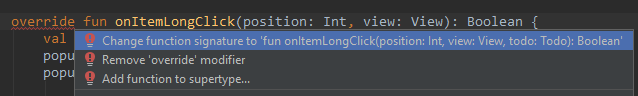

# Perzisztencia

## Felkészülés a laborra

A labor célja a relációs adatbáziskezelés és az [Architecture Components](https://developer.android.com/jetpack#architecture-components) bemutatása Android platformon. A feladatok során a korábban elkészített Todo lista alkalmazást fejlesztjük tovább. 

Az alkalmazás SQLite adatbázisban fogja tárolni a Todo elemeket, így azok nem fognak elveszni amikor a felhasználó elnavigál, vagy elforgatja a készüléket. A laboron a Room könyvtárat fogjuk használni, mely egy absztrakciós réteget biztosít az SQLite adatbázisok kezeléséhez szükséges osztályok fölé, így leegyszerűsítve az adatbázis-kezelést.

## Kiinduló projekt

Töltsük le a kiinduló projektet:

[Kiinduló project](./todo_kiindulo.zip)

Tömörítsük ki a projektet tartalmazó mappát, indítsuk el az Android Studio-t, majd nyissuk meg a projektet.

Ez a Todo alkalmazás még csak memóriában tárolja a futása során létrehozott Todo elemeket.

Nézzük meg a `model` package-ben lévő `Todo` osztályt, amit a korábbi laboron már létrehoztunk. Ehhez hozzáadtunk egy `id` nevű property-t, ami az adatbázisban fogja egyedien azonosítani a példányokat. Ennek a property-nek adtunk egy [default értéket](https://kotlinlang.org/docs/reference/functions.html#default-arguments), hogy az explicit megadása nélkül is tudjunk `Todo` példányokat létrehozni.

## Adattárolás SQLite adatbázisban

Célunk, hogy a a Todo objektumok memóriában tárolása helyett az alkalmazás a Room segítségével egy SQLite adatbázisban perzisztensen mentse őket. Tehát az, hogy ne veszítsük el a felvett Todo-kat az alkalmazás bezárásakor. 

A `SimpleItemRecyclerViewAdapter` a módosítások után nem a memóriában tárolt Todo listát fogja megjeleníteni, hanem majd az adatbázisból olvassa ki és köti össze azt a `RecyclerView`-val.

A feladat megvalósítása három részből áll:

1. Todo objektumok perzisztens tárolásának megvalósítása adatbázissal
2. Repository osztály elkészítése, mely az adatbázis elérésének implementációját elrejti a felsőbb rétegek elől
3. ViewModel megvalósítása, ami háttérszálra teszi a blokkoló műveleteket és elválasztja a UI implementációját az adatrétegtől 

### Todo-k tárolása adatbázisban

Ahhoz, hogy az alkalmazásunkban használni tudjuk a Room könyvtárat, függőségként hozzá kell adnunk az app szintű `build.gradle` fájlhoz:

```gradle
dependencies {
    ...
    // Room
    def room_version = '2.2.5'
    implementation "androidx.room:room-runtime:$room_version"
    kapt "androidx.room:room-compiler:$room_version"
}
```
Ezután szinkronizáljuk a projektet.

Ahhoz, hogy a kapt kulcsszó is működjön és a gradle felismerje, engedélyeznünk kell a Kotlin Annotation Processing Toolt. Ezt szintén a modul szintű build.gradle fájlban tudjuk bekapcsolni. Ezt a kiinduló projektben **már megtettük**, a fájl tetejére illesztve a következőt:

```gradle
apply plugin: 'kotlin-kapt'
```

A Roomal 3 fő komponens csoport definiálható:
- **Adatbázis**: A [`@Database`](https://developer.android.com/reference/androidx/room/Database) annotációval megjelölt abstract osztály, melyhez az implementációt a Room generálja majd. Az adatbázis általános beállításai itt adhatóak meg további annotációkkal. A `@Database` annotáció `entitites` paraméterében kell felsorolni azokat az `@Entity` annotációval ellátott osztályokat, amiket szeretnénk az adott adatbázisban kezelni.
- **Entityk**: Egy osztályra az [`@Entity`](https://developer.android.com/training/data-storage/room/defining-data) annotációt rakva jelezhetjük, hogy az adott osztályt szeretnénk leképezni egy adatbázis táblára. 
- **DAO**: A [`@DAO`](https://developer.android.com/training/data-storage/room/accessing-data) (Data Access Object) annotációval ellátott osztályok az adatok manipulálásáért felelnek. Azokat a metódusokat tartalmazzák, melyekkel az adatbázist elérjük és módosításokat végezhetünk.

Az alkalmazás a Room által generált adatbázis osztályt használja fel arra, hogy elérje a  DAO osztályokat. Az alkalmazás ezután már eléri a DAO-kon keresztül az adatbázis táblákat, amin futtathatunk lekérdezéseket. Végül az alkalmazás az `Entity`-ken keresztül beállítja az adatbázisban található táblázatok oszlopoknak megfelelő értékeket.
<p align=center>

</p>

Hozzunk létre a projektben a `hu.bme.aut.android.todo` package-en belül egy új package-et `database` néven. Ezen belül hozzuk létre a Todo-kat tároló Room entitást. Az entitásokat egyszerű Kotlin [data class](https://kotlinlang.org/docs/reference/data-classes.html)-okkal fogjuk létrehozni, a megfelelő annotációkkal ellátva.

```kotlin
@Entity(tableName = "todo")
data class RoomTodo(
    @PrimaryKey(autoGenerate = true)
    val id: Long = 0,
    val title: String,
    val priority: Todo.Priority,
    val dueDate: String,
    val description: String
)
```

Nézzük meg, hogy mit jelentenek az előbb használt annotációk:
- `@Entity(tableName = "todo")`: Minden `@Entity` annotációval ellátott osztály egy SQLite táblát reprezentál. A `tableName` paraméterrel megadható a tábla neve. Ennek hiányában az osztály neve lesz a tábla neve. SQLite-ban a táblák nevei case-insensitive-ek. 
- `@PrimaryKey`: Minden entitásnak kötelezően meg kell adni az elsődleges kulcsát. A Room támogatja az autogenerált elsődleges kulcsokat is a következőképp: `@PrimaryKey(autoGenerate = true)`. 

A Room nem fogja tudni, hogy hogyan tárolja és olvassa visszza a `Todo.Priority` enum értéket, ezért két [TypeConverter](https://developer.android.com/reference/kotlin/androidx/room/TypeConverter)-rel annotált függvénnyel definiálni kell a mentés és visszaolvasás formátumát és az átalakítások műveleteit. A Room fel fogja ismerni a `@TypeConverter` annotáció segítségével a függvény paraméter alapján, hogy mire kell konvertálni az enumot, illetve lekérdezéskor visszatérés alapján melyik enum értékre kell visszakonvertálni. Minden konverter metódusnak 1 bemenő paramétere és egy nem `null` visszatérési értéke van. 
A `@TypeConverter`-t függvény párokra érdemes rakni, amik közül az egyik a domain reprezentációból az adatbázis reprezentációba konvertál, a másik pedig vice-versa.

Ezeket a függvényeket nem ismeri fel csak úgy a Room generátora. A Room adatbázis osztályba `@TypeConverters` annotációval meg kell adni azokat az osztályokat, amikben ilyen függvények vannak. Lásd a dokumentációban: [https://developer.android.com/reference/kotlin/androidx/room/TypeConverters](https://developer.android.com/reference/kotlin/androidx/room/TypeConverters)

```kotlin
class TodoTypeConverter {

    companion object {
        const val LOW = "LOW"
        const val MEDIUM = "MEDIUM"
        const val HIGH = "HIGH"
    }

    @TypeConverter
    fun toPriority(value: String?): Todo.Priority {
        return when (value) {
            LOW -> Todo.Priority.LOW
            MEDIUM -> Todo.Priority.MEDIUM
            HIGH -> Todo.Priority.HIGH
            else -> Todo.Priority.LOW
        }
    }

    @TypeConverter
    fun toString(enumValue: Todo.Priority): String? {
        return enumValue.name
    }

}
```

Következő lépésként hozzuk létre a Todo elemeink DAO osztályát.  Mi csak egy megfelelő annotációkkal ellátott interface-t definiálunk, az implementációt pedig a Room generálja majd nekünk. Az interface függvényein lévő annotációk magukért beszélnek - az `@Insert` beilleszt elemeket, a `@Delete` töröl, a `@Query`-be pedig paraméterként tetszőleges SQL kódot írhatunk, kódkiegészítésel!

```kotlin
@Dao
interface TodoDao {

    @Insert
    fun insertTodo(todo: RoomTodo)

    @Query("SELECT * FROM todo")
    fun getAllTodos(): LiveData<List<RoomTodo>>

    @Update
    fun updateTodo(todo: RoomTodo): Int

    @Delete
    fun deleteTodo(todo: RoomTodo)

}
```
Ha az adatok megváltoznak az adatbázisban, arra általában reagálni szeretnénk valahogy, például a frissített todo listánkat meg szeretnénk jeleníteni a felületen. Az összes Todo lekérdezésekor egy [LiveData](https://developer.android.com/topic/libraries/architecture/livedata) objektumot adunk át, mely egy [lifecycle könyvtár](https://developer.android.com/topic/libraries/architecture/lifecycle.html) elem. A `LiveData`-k segítségével feliratkozhatunk bizonyos adatok változásaira callback metódusokkal, így a `LiveData`-t figyelő (observer) metódusok reagálhatnak a változott adatra. `LiveData` visszatérési érték típus használa esetén a Room legenerálja az összes szükséges kódot ahhoz, hogy megfigyelhetőek legyenek az adatbázis változásai.
A laborvezetővel nézzük át, hogy miket csinálnak a `TodoDao` függvényei és a hozzájuk tartozó annotációk.

A generált DAO implementáció egy `RoomDatabase`-ből származó osztály segítségével érhető el. Az adatbázis általános beállításai itt adhatóak meg, szintén annotációkkal. Az entitásokat és típus konvertereket is ebben az osztályban kell felsorolni a megfelelő annotációkon belül. Hozzuk létre a `TodoDatabase`-t szintén a `database` package-ben. 

```kotlin
@Database(
    version = 1,
    exportSchema = false,
    entities = [RoomTodo::class]
)
@TypeConverters(
    TodoTypeConverter::class
)
abstract class TodoDatabase : RoomDatabase() {

    abstract fun todoDao(): TodoDao

}
```

## A Repository osztály elkészítése 

Következő lépésként készítsük el a `Repository` osztályunkat. A `Respository` osztály elfedi előlünk az adatelérési réteget. Ha például adatokat szeretnénk kinyerni helyi adatbázisból (Room) és hálózatról is, akkor a felsőbb rétegek számára elrejtük az adatok elérési módját. Emellett ennek az osztálynak a feladata az is, hogy háttérszálra szervezze az adatmanipulációs hívásokat, hogy azok ne blokkolják a fő (UI) szálat.
Ugyan a Room magával hozza a `LiveData` függőségeket (ezért is tudtuk importálni a `TodoDao` osztályba), ettől függetlenül érdemes külön függőségként is felvenni a `build.gradle (Module: app)` fájlban. A Room esetleges lecserélésekor így a `Repository` osztályban és az alkalmazás többi részében továbbra is elérhető marad a `LiveData`.

```gradle
dependencies {
    ...
    def lifecycle_version = "2.2.0"    
    // LiveData
    implementation "androidx.lifecycle:lifecycle-livedata-ktx:$lifecycle_version"

    // Coroutine	
    implementation 'org.jetbrains.kotlinx:kotlinx-coroutines-core:1.3.4'
}
```
A `Repository` osztályunkban háttérszálra szeretnénk tenni a blokkoló adatbázis műveleteket, amihez a [kotlinx coroutine](https://github.com/Kotlin/kotlinx.coroutines) könyvtár elemeit szeretnénk használni, így ezt is felvettük a függőségek közé.
Hozzuk létre a `hu.bme.aut.android.todo` package-en belül a `repository` package-et, melybe implementáljuk a `Repository` osztályunkat:


```kotlin
class Repository(private val todoDao: TodoDao) {

    fun getAllTodos(): LiveData<List<Todo>> {
        return todoDao.getAllTodos()
            .map {roomTodos ->
                roomTodos.map {roomTodo ->
                    roomTodo.toDomainModel() }
            }
    }

    suspend fun insert(todo: Todo) = withContext(Dispatchers.IO) {
        todoDao.insertTodo(todo.toRoomModel())
    }

    private fun RoomTodo.toDomainModel(): Todo {
        return Todo(
            id = id,
            title = title,
            priority = priority,
            description = description,
            dueDate = dueDate
        )
    }

    private fun Todo.toRoomModel(): RoomTodo {
        return RoomTodo(
            title = title,
            priority = priority,
            description = description,
            dueDate = dueDate
        )
    }
}
```

A `LiveData` belül háttérszálon végzi az adatok lekérdezését, így azt nekünk már nem kell `coroutine scope`-ban elvégezni. A Kotlin `coroutine` egy nyelvi feature, mely segítségével könnyen írhatunk párhuzamosan futó programokat (aszinkron futó kódot). A `suspend` kulcsszóval mondhatjuk meg, hogy az adott függvény megakaszthatja a hívó szálat, valamilyen lassú művelet miatt (ilyenek tipikusan az adatbázis vagy hálózati műveletek). Az adatbázisba írás hosszantartó, UI-t blokkoló művelet lehet, a `withContext(Dispatchers.IO)` függvény az [`IO`](https://kotlin.github.io/kotlinx.coroutines/kotlinx-coroutines-core/kotlinx.coroutines/-dispatchers/-i-o.html) thread pool-on hajtja végre a paramétereként kapott lambda kifejezést.

A `getAllTodos` függvényben az első `map` az a [lifecycle map](https://developer.android.com/reference/android/arch/lifecycle/Transformations#map) függvénye, ami egy `LiveData<x>`-ből `LiveData<Y>`-t csinál. A második `map` pedig a lista elemek transzformálásához kell. Kicsit szerencsétlen, hogy a két függvénynek ugyanaz a neve, kódból ránézésre nem is látszik a különbség, csak ha belenézünk az implementációba. Esetünkben itt a `LiveData<List<RoomTodo>>`-t `LiveData<List<Todo>>`-ra transzformáljuk.

A `Repository` osztályunkban található két [extension function](https://kotlinlang.org/docs/reference/extensions.html#extension-functions), melyek a Room Todo és az alkalmazásban használt Todo model közötti konverziókat végzik, így a `Repository`-t felhasználó osztályok elől elrejti az adatbázis implementációját, csak a `model` package osztályait ajánlja ki.

## Egyedi Application osztály készítése

Készítsünk egy egyedi Application osztályt `TodoApplication` néven. Az `Application` az alkalmazás futása során folyamatosan jelen lévő objektum, melyet a futtatókörnyezet hoz létre automatikusan az alkalmazás indulásakor. Élettartama az alkalmazáshoz tartozó process élettartamához kötődik. A `TodoApplication` fogja fenntartani az adatbáziskapcsolatot reprezentáló `TodoDatabase` objektumot, így azt nem kell minden `Activity`-ből külön-külön, erőforrás pazarló módon példányosítani.

A `hu.bme.aut.android.todo` package-en belül hozzuk létre a `TodoApplication` osztályt:

```kotlin
class TodoApplication : Application() {

	companion object {
		lateinit var todoDatabase: TodoDatabase
	  		private set
	}
	
	override fun onCreate() {
		super.onCreate()

		todoDatabase = Room.databaseBuilder(
                    applicationContext,
                    TodoDatabase::class.java,
                    "todo_database"
                ).build()
	}
	
}
```

> A `todoDatabase` propertynél leírt [`private set`](https://kotlinlang.org/docs/reference/properties.html#getters-and-setters) segítségével azt érjük el, hogy a property settere privát lesz, de a gettere publikus marad (ha magára a property-re helyeznénk el a `private` kulcsszót, mindkettő priváttá válna). Ezzel elérjük, hogy az aktuális osztályon kívülről ne lehessen átállítani az értékét.

Az `AndroidManifest.xml`-ben állítsuk be, hogy a rendszer a `TodoApplication` osztályt példányosítsa az alkalmazás induláskor. Ehhez a manifestben lévő `<application>` tagben fel kell vennünk egy attribútumot `android:name` néven, aminek az értéke legyen a `TodoApplication` minősített (fully-qualified) osztályneve:

```xml
<application
        android:allowBackup="true"
        android:icon="@mipmap/ic_launcher"
        android:label="@string/app_name"
        android:roundIcon="@mipmap/ic_launcher"
        android:supportsRtl="true"
        android:theme="@style/AppTheme"
        android:name=".TodoApplication">
```

Bár az `android:name` attribútum értékének egy fully-qualified osztálynévnek kell lennie, a rendszer elfogadja a manifestben beállított `package` névhez relatív értéket is. Figyeljük meg, hogy az `android:name` beállításakor a fejlesztőkörnyezet <kbd>Ctrl</kbd>+<kbd>Space</kbd> lenyomására segíti az osztálynév megadását.

Ezt követően a `TodoApplication` osztály [companion object](https://kotlinlang.org/docs/tutorials/kotlin-for-py/objects-and-companion-objects.html#companion-objects)-jének `todoDatabase` propertyjével bármikor elérhetjük a Room adatbázis kapcsolatunkat, a `TodoApplication.todoDatabase` szintaxissal.

## A ViewModel elkészítése

A `ViewModel` szerepe az, hogy adatokat biztosítson a UI felé. Kommunikációs központként viselkedik a Repository és a UI között.

<p align=center>

</p>

A `ViewModel` szintén a korábban említett [lifecycle library](https://developer.android.com/topic/libraries/architecture/lifecycle.html) része, ezért hozzá kell adni függőségként a `build.gradle (Module: app)`-hez:

```gradle
dependencies {
...
    // ViewModel
    implementation "androidx.lifecycle:lifecycle-viewmodel-ktx:$lifecycle_version"
}
```

A `ViewModel` segítségével biztosítjuk azt, hogy elkülönüljenek a UI adatai az `Activity` és a `Fragment` osztályok kódjaitól. Míg az utóbbiak a felület megjelenéséért felelnek, a `ViewModel` tárolja és dolgozza fel a UI-nak szükséges adatokat. A `ViewModel`-ben a korábban bemutatott `LiveData`-t fogjuk használni a képernyőn megjelenített gyakran változó adatokhoz, ami itt a todo lista lesz. Ennek előnye, hogy a `Livedata` elemekhez be lehet állítani observereket, melyek segítségével akkor kell csak frissíteni a felületet, ha a `LiveData` által tárolt adat változik. 
Hozzuk létre a `viewmodel` package-t, melybe implementáljuk `TodoViewModel` osztályunkat:

```kotlin
class TodoViewModel : ViewModel() {

    private val repository: Repository

    val allTodos: LiveData<List<Todo>>

    init {
        val todoDao = TodoApplication.todoDatabase.todoDao()
        repository = Repository(todoDao)
        allTodos = repository.getAllTodos()
    }

    fun insert(todo: Todo) = viewModelScope.launch {
        repository.insert(todo)
    }
}
```

A `TodoViewModel` az `insert` függvényében meghívja a `Repository.insert` függvényét, mely egy blokkoló `suspend` hívás. Ezt a hívást teszi háttérszálra a `ViewModel` a `launch` függvény segítségével, mely híváskor visszatér és háttérszálra teszi a paraméterként megkapott lambdát, egy `coroutine`-ba. A `ViewModel`-eknek saját [coroutine scope](https://kotlinlang.org/docs/reference/coroutines/coroutine-context-and-dispatchers.html#coroutine-scope)-juk van a saját életciklus függvényhívásaik miatt, ezért itt ezt fel is használjuk.

> A `coroutine`-okról bővebben a Kotlin alapú szoftverfejlesztés (VIAUAV41) tárgy [Coroutines](https://github.com/bmeaut/VIAUAV41/blob/master/material/10.md) fejezetében olvashatsz.


## A TodoListActivity módosítása

Az adatbázis alapú perzisztencia használatához minden rendelkezésre áll, már csak a `TodoListActivity`-ben kell áttérnünk az adatok adatbázisban tárolásra.

Adjuk hozzá a `TodoListActivity`-hez a `TodoViewModel` referenciáját:

```kotlin
    private lateinit var todoViewModel: TodoViewModel
```

Az `onCreate` függvény végén hozzuk létre a `ViewModel`-t a `ViewModelProvider` segítségével, majd iratkozzunk fel a `TodoViewModel` `allTodos` property változásaira:

```kotlin
        todoViewModel = ViewModelProvider(this).get(TodoViewModel::class.java)
        todoViewModel.allTodos.observe(this) { todos ->
            simpleItemRecyclerViewAdapter.addAll(todos)
        }
```

> A `TodoViewModel.allTodos` property-je `LiveData` típusú, mely a Todo listát kezeli. Minden változáskor lefut az `observe` függvénynek átadott lambda kifejezés, ahol frissítjük a `SimpleItemRecyclerViewAdapter` Todo listát.


Töröljük ki a `setupRecyclerView` metódusból a `demoData` listát és az adapterhez való hozzáadását:

```kotlin
    private fun setupRecyclerView() {
        simpleItemRecyclerViewAdapter = SimpleItemRecyclerViewAdapter()
        simpleItemRecyclerViewAdapter.itemClickListener = this
        rvTodoList.adapter = simpleItemRecyclerViewAdapter
    }
```

Módosítsuk az `onTodoCreated` metódust úgy, hogy a `todoViewModel`-en keresztül beszúrjuk az adatbázisba az új Todo elemet:

```kotlin
    override fun onTodoCreated(todo: Todo) {
        todoViewModel.insert(todo)
    }
```

Próbáljuk ki az alkalmazást! 
Adjunk hozzá néhány Todo elemet, majd forgassuk el a készüléket. Állítsuk le az alkalmazást és indítsuk újra. Az adatoknak meg kell maradniuk újraindítás után is.

## A generált kód vizsgálása

A build folyamat során a Room legenerálja az adatbázis kezelést segítő boilerplate kódot. A laborvezetővel nézzük át, hogy mennyi kód megírását spóroljuk meg a Room könyvtár használatával. A Room osztályok nevein <kbd>ctrl</kbd> + kattintás vagy <kbd>ctrl</kbd> + <kbd>B</kbd> kombinációkkal az Android Studio felsorolja az osztály előfordulásait. 
Nézzük át a következőket:
- `TodoDai_Impl.java`
- `TodoDatabase_Impl.java`

## Egy Todo elem törlése

A következő feladat az, hogy hosszan nyomásra működjön a kiválasztott Todo elem törlése az adatbázisból. Ehhez első lépésként bővítsük az `SimpleItemRecyclerViewAdapter.TodoItemClickListener` interfész `onItemLongClick` metódusának paramétereit úgy, hogy egyszerű legyen Todo elemet átadni rajta keresztül a `ViewModel`-nek:

```kotlin
    interface TodoItemClickListener {
        fun onItemClick(todo: Todo)
        fun onItemLongClick(position: Int, view: View, todo: Todo): Boolean
    }
```

Az előbb módosított interfész metódust a `ViewHolder` `init` blokkjában hívjuk meg. Módosítsuk úgy, hogy harmadik paraméterként átadjuk a Todo modellünket is, a korábban megismert módon:

```kotlin
            itemView.setOnLongClickListener { view ->
                todo?.let {todo -> itemClickListener?.onItemLongClick(adapterPosition, view, todo) }
                true
            }
```

A `TodoListActivity` valósítja meg a `TodoItemClickListener` interfészt, ezért itt is módosítanunk kell az `onItemLongClick` függvény fejlécét úgy, hogy harmadik paraméterként átveszi a Todo elemet. Az Android Studio felismeri, hogy megváltozott a megvalósítandó függvény fejléce, ezért a módosítást megtehetjük úgy, hogy a hibajelzésre visszük a kurzort és <kbd>alt</kbd> + <kbd>enter</kbd> billentyűkombináció megnyomása után kiválasztjuk az első javaslatot.

<p align=center>

</p>

Most térjünk vissza a Room adatbázis osztályokra. Todo elemet az adatbázisból a `TodoDao`-ban lévő `@Delete` annotációval ellátott `deleteTodo` függvény segítségével fogunk tudni törölni. Ez a függvény egy `RoomTodo` típusú Room entityt vár paraméterül. Készítsünk egy olyan függvényt a `TodoDao`-n belül, amely egy Todo-t ad vissza azonosító alapján (amely azonosító egyben a `RoomTodo` elsődleges kulcsa is). A `@Query()` annotációba paraméterként tetszőleges SQL kifejezést írhatunk, ezt kihasználva ennek az implementálása a következő:

```kotlin
    @Query("SELECT * FROM todo WHERE id == :id")
    fun getTodoById(id: Long?): RoomTodo?
```

Láthatjuk, hogy az SQL kifejezésben felhasználjuk a függvény paraméterereként megkapott azonosítót, a paraméter értékét kettősponttal oldjuk fel az SQL kifejezésben. A korábban bemutatott módon figyeljük meg, hogy a Room mit generál ebből a metódusból. A paraméterként kapott `id` és a visszatérési érték is nullable, ezért a generált kódba ezt az esetet külön lekezeli a Room. Kísérletezésképpen próbáljuk ki, hogy mit generál a Room, ha a paraméter vagy a visszatérés nem nullable. 

Következő lépésben a `TodoRespository`  osztályt kell bővítenünk egy új metódussal, amely meghívja a `TodoDao` Todo elem törlés metódusát és paraméterként egy Todo modellt vár. A Dao `deleteTodo` metódusa viszont egy Room Todo példányt vár, azonban ehhez nem lesz jó a Repository `insert` metódusában használt `Todo.toRoomModel` extension function, mivel az nem adja át a Todo modell `id`-t, mert azt a Room generálja. Ennek megoldására a `Repository` osztály `delete` függvénye paraméterként átvesz egy Todo modellt, majd az `id` alapján a `TodoDao`-tól elkéri a törölni kívánt Room Todo példányt, amit a Dao `deleteTodo` függvénnyel töröl az adatbázisból:

```kotlin
    suspend fun delete(todo: Todo) = withContext(Dispatchers.IO) {
        val roomTodo = todoDao.getTodoById(todo.id) ?: return@withContext
        todoDao.deleteTodo(roomTodo)
    }
```

> Érdemes megfigyelni az elvis `?:` operátor használatát arra az esetre, ha a Dao `getTodoById` függvénye `null`-t ad vissza valami miatt (például ha olyan `id`-t adunk meg, amely elsődleges kulcshoz nincs Todo az adatbázisban). Ekkor a `withContext` függvényhívásból a `return@withContext` szintaktikával térünk vissza. Ez az úgynevezett [Return at labels](https://kotlinlang.org/docs/reference/returns.html#return-at-labels) megoldás, mellyel egymásba ágyazott függvényhívások esetén meghatározhatjuk, hogy melyik függvényből történik a visszatérés.

Az előbb megírt függvényünket a `TodoViewModel` fogja meghívni. Az `insert` függvény mintájára készítsük el a `ViewModel` osztály `delete` függvényét is:

```kotlin
    fun delete(todo: Todo) = viewModelScope.launch {
        repository.delete(todo)
    }
```

Utolsó lépésként a `TodoListActivity`-ben kell lecserélni a törlés menüpont kiválasztását lekezelő kódsort az újonnan megírt `ViewModel` `delete` hívására. Cseréljük ki az `onItemLongClick` függvényben a `simpleItemRecyclerViewAdapter.deleteRow(position)` sort a `todoViewModel.delete(todo)` hívásra:

```kotlin
    override fun onItemLongClick(position: Int, view: View, todo: Todo): Boolean {
        val popup = PopupMenu(this, view)
        popup.inflate(R.menu.menu_todo)
        popup.setOnMenuItemClickListener { item ->
            when (item.itemId) {
                R.id.delete -> {
                    todoViewModel.delete(todo)
                    return@setOnMenuItemClickListener true
                }
            }
            false
        }
        popup.show()
        return false
    }
```

A `TodoViewModel.delete` hívás után érdemes `true`-val visszatérni a callbackből, ha esetleg a `menu_todo` menüt bővíteni szeretnénk, a többi feliratkozó függvény már ne fusson le.

Futtassuk az alkalmazást és próbáljuk ki a Todo elem törlését. Nézzük meg a `TodoDao` új generált metódusát is.

## Önálló feladat

Az eredeti funkcionalitás további részeinek megvalósítása önálló feladatként oldandó meg:

-  Az összes Todo elem törlésére is legyen lehetőség (pl. Options menüből elérve)
-  **opcionális**: Hosszan nyomás esetén egy bővített menüben legyen lehetőség a kiválasztott Todo elem módosítására

> *Tipp:* A DAO-ban a  `@Query()` annotációval tetszőleges SQL kifejezést tudunk írni 😉

